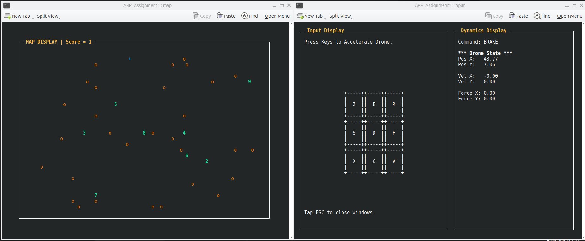
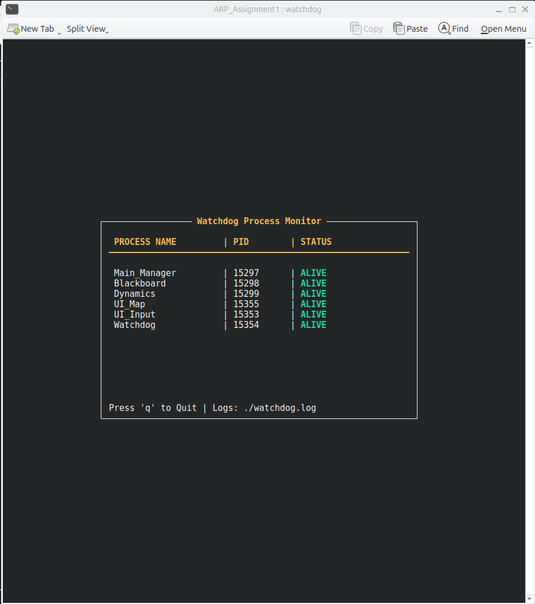
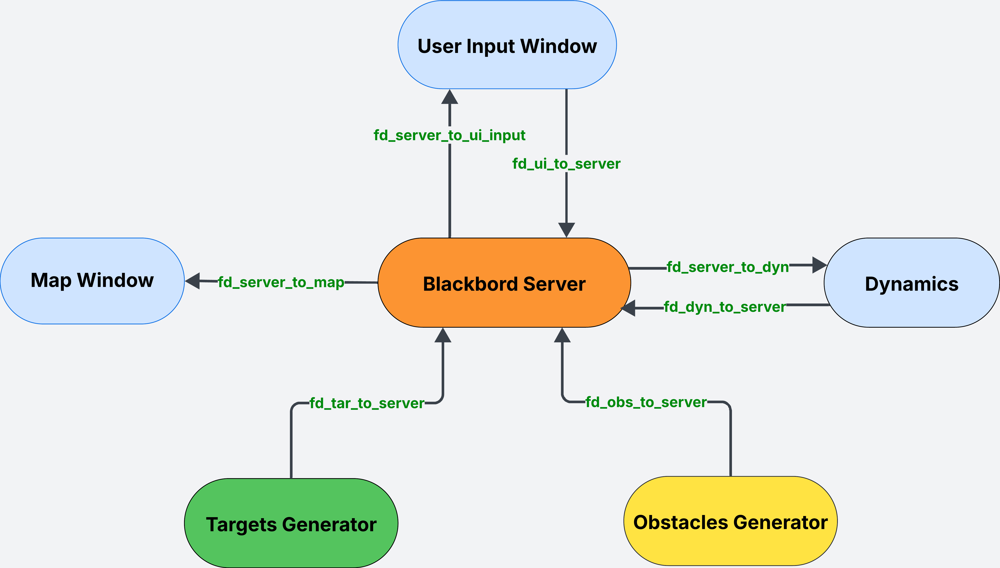

#  Drone Simulator  
### *Advanced Robot Programming – Assignment 3*

**Student:** Bahri Riadh  
**ID:** 8335614  
**Tested with :** Hani Bouhraoui 
---

## 1. Project Overview

This project implements a multi-process drone simulation system using **Ncurses** for visualization and **Named Pipes (FIFOs)** for inter-process communication. The architecture follows a **Star Topology** centered around a **Blackboard Server**.
In the final phase (Assignment 3), the system extends to support **Multiplayer Networking** via TCP Sockets.This allows two instances of the simulator (Server and Client) to connect over a network, synchronizing drone positions in real-time.

## 2.Evolution of the Project:

**Assignment 1:** Implemented the core simulation, physics engine, collision detection, and UI.

**Assignment 2:** Added system reliability via a Watchdog process and safe File Logging.

**Assignment 3 :** Added distributed capabilities via TCP Sockets, enabling Multiplayer functionality.

**Simulation Demo:**
The simulation runs across three synchronized terminal windows:

* UI Map : Visualizes the drone, targets, and obstacles.

* UI Input : Handles keyboard control and displays real-time telemetry.

* Watchdog : Monitors the health status of all active processes.



**Goal:** 
* Standalone Mode:  Navigate a drone (Blue +) to collect sequential targets (Green 1–9) while avoiding repulsive obstacles (Yellow o), all while the Watchdog ensures system stability.
* Multiplayer Mode:  Navigate freely while avoiding the other player (rendered as an obstacle).

---
## 3. System Architecture
The system utilizes a centralized architecture where the Blackboard acts as the server. All other processes (Drone Dynamics, UI, Obstacles, Targets) act as clients that communicate exclusively through the Blackboard.(Note: The Watchdog operates as a separate supervisor parallel to this topology).


### Communication Protocol
* Local IPC : Named Pipes (FIFOs) for internal processes.

* Remote IPC: TCP Sockets for Server-Client communication (Assignment 3).

* Non-Blocking I/O: The server uses O_NONBLOCK to ensure the simulation runs smoothly without hanging on empty pipes.
## 3. Assignment 2 Features (New)

The second phase of the project introduces system monitoring and safety mechanisms.

### A. Watchdog Process :

A cyclic process that monitors the health of all other active components.

* Polling: Wakes up every $T$ seconds (configurable).

* Mechanism: Sends Signal 0 to check if a PID is alive.

* Alerts: If a process crashes, it logs an alert to system.log and visually flags it as "NOT RESPONDING" in the Watchdog Window.

### B. Safe File Logging : 

To prevent race conditions when multiple processes write to logs simultaneously, the system implements File Locking (fcntl).

* Process List: All processes register their Name and PID in process_list.txt upon startup.

* Logs: Two distinct log files are maintained:

      - watchdog.log: For routine health checks.

      - system.log: for the critical errors and state changes.

## 4. Assignment 3 Features (Networking): 
### A. Operation Modes
The game behavior changes significantly depending on the mode selected at startup. This design ensures the same codebase can handle single-player logic and distributed networking logic.

* Standalone (Legacy Mode):

This mode runs the full simulation locally for single-player practice. Random targets and obstacles are generated automatically to provide a challenge, and the Watchdog process remains active to monitor system reliability.

* Server (The Host):
Acts as the host for a multiplayer session by opening Port 8080. It disables local obstacle generators and the Watchdog to prevent synchronization issues, relying instead on the connected client to serve as the dynamic obstacle.

* Client (The Guest):
Connects to the Server's IP address to join an existing session. It automatically synchronizes its map configuration with the host and disables local generators and monitoring, focusing entirely on real-time interaction with the remote player.

### B.Network Protocol :
This defines the "Language" the two computers speak. It is strictly synchronous (Step-by-Step) to prevent data corruption.

* Handshake (The Setup):

ok $\to$ ook: Confirms connection stability. "Are you there?" -> "Yes, I am here."

size $\to$ sok: The Server dictates the Map Width/Height. The Client receives these dimensions, resizes its window if necessary, and confirms receipt.

* Exchange (The Loop):

drone → dok: "Here are my coordinates." -> "Data received (OK)."

obst → pok: "Where are you?" -> "Here are my coordinates (as an obstacle)." -> "Data received (OK)."

* Note: To the local player, the remote player is treated mathematically as an Obstacle (O), triggering the repulsion force logic.
### C.Technical Implementation :
* Packet Handling: Implemented a "Smart Reader" (byte-by-byte) to resolve TCP packet merging issues.

* Rate Limiting: Decouples network I/O (10Hz) from physics calculation (100Hz) to prevent input lag.
## 5. Components and Algorithms : 

This section details the logic implemented in each source file.

---

### A. Main Process (`src/main.c`)

#### **Role**
Process Launcher and Lifecycle Manager.

#### **Primitives**
`fork()`, `exec()`, `signal()`, `mkfifo()`

#### **Logic**
- Mode Selection: Prompts user to select Standalone, Server, or Client mode.
- itialization: Creates all Named Pipes (FIFOs).
- Process Management: Forks internal processes (Blackboard, Dynamics).
- Conditional Launch: 
      * If Standalone: Forks Generators (Obstacles, Targets) and Watchdog.

      * If Multiplayer: Skips Generators and Watchdog.
- New: Registers its own PID for monitoring.

#### **Shutdown Strategy** 
Upon receiving `SIGINT`, the main process sends SIGTERM to all child PIDs and unlinks (deletes) the pipes to ensure a clean exit.


### B. Blackboard Server (`src/blackboard.c`)

#### **Role**
Central State Manager and  Message Router.

#### **Primitives**
`open(O_RDWR)`, `read(O_NONBLOCK)`, `write()`

#### **Algorithm (Loop 1000 Hz):**
1. Read Inputs: Drain pipes from UI Input and Dynamics to get local commands and position.
2. Handle Environment:
      * If Standalone: Read from local Obstacle and Target pipes.
      * If Multiplayer: Call `socket_manager` to exchange position data with the remote player (Network I/O rate-limited to 10Hz).
3. Broadcast: Send current state (Drone, Obstacles, Targets) to UI Map and Dynamics.

---

### C. Drone Dynamics (`src/dynamics.c`)

#### **Role**
Physics Engine and Collision Detection.

#### **Primitives**
Euler Integration, Vector Math.

---

#### **Algorithm 1 — Physics Model**

Uses the equation:

`F = ma + kv`

Loop (500 Hz):

1. Calculate Repulsion Force:
If Distance < 10m:
`F_rep += (1/Distance - 1/Rho) * (1/Distance²)`

2. Calculate Total Force:
`F_total = Command_Force + F_rep`

3. Euler Integration:
`Acceleration = (F_total - K * Velocity) / Mass`
`Velocity += Acceleration * T`
`Position += Velocity * T`

---
#### **Algorithm 2 — Attraction field**

Algorithm Attraction_Field:

1. Initialize attraction force vector `F_att = (0, 0)`

2. If the next required target exists AND is active:
      a. Compute displacement:
            `dx = target.x − drone.x`
            `dy = target.y − drone.y`

      b. Compute distance to the target:
           ` dist = sqrt(dx² + dy²)`

      c. If the drone is inside the attraction radius `(dist < ATTRACTION_RHO)`:
            Apply attraction:
            `F_att.x = ATTRACTION_ETA * dx`
            `F_att.y = ATTRACTION_ETA * dy`

3. Return the attraction force vector `F_att`
 
---
#### **Algorithm 3 — Collision Detection**
* If `Distance(Drone, Target[i]) < 2.0m`:
* If `Target[i].ID == Next_Required_ID`:
 1. Mark Target as Collected
 2. Respawn Target
 3. Send Update to Server

---

### D. UI Input (`src/ui_input.c`)

#### **Role**
Controller and Telemetry Display.

#### **Primitives**
`getch()`, `Ncurses`

#### **Algorithm**
* Loop (50 Hz):
1. Telemetry: display current position, velocity, and score.
2. Burst Read: Loop getch() to capture all keystrokes in the buffer.
3. Command: Calculate the force vector based on keys pressed and write to the server.

---

### E. UI Map (`src/ui_map.c`)

#### **Role**
Visualizer.

#### **Primitives**
Ncurses Colors, Coordinate Scaling.
* Loop (50 Hz):
1. Read State from Server
2. Adjust Scaling if terminal resized
3. Draw Entities (Drone, Obstacles, Targets)
   
---

### F. Generators (`src/obstacles.c`, `src/targets.c`)

#### **Role**
Procedural Generation.
* Loop:
1. Sleep(Interval)
2. Generate Random X, Y
3. Send `MSG_OBSTACLE` or `MSG_TARGET` to Server

---
### G. Watchdog Process(`src/watchdog.c`)
#### **Role**
System Health Monitor.
#### **Algorithm :**
* (Loop $T$ Seconds):
      1. Open process_list.txt (with Read Lock).

      2. Read every Name and PID.

      3. Send kill(pid, 0) to check status.

      4. Update Ncurses UI (Green=Alive, Red=Dead).

      5. Log result to watchdog.log.

      6. Release Lock and Sleep.
---
---
### H. Utilities (`src/utilities.c`):
#### **Role**
Shared Helper Functions for Safety.
#### **Algorithm :**Update the internal state struct.
4. Route Data:
      * Switch(Message Type):
      * DRONE_STATE → Broadcast to Map and UI_Input
      * FORCE → Forward to Dynamics
      * OBSTACLE → Forward to Map and Dynamics
      * TARGET → Forward to Map and Dynamics
* 
      1. `file_lock()`: Wrapper for fcntl to handle F_SETLKW (Blocking Wait).

      2. `register_process()`: Safe write of PID to the process list.

      3. `log_message()`: Safe write (Open -> Lock -> Write -> Unlock -> Close) to log files.
---
### G. Socket Manager(`src/socket_manager.c`)
#### **Role**
Network Interface Layer (Assignment 3).
#### **Primitives**
`socket()`, `bind()`, `accept()`, `connect()`, `send()`, `recv()`
#### **Algorithm :**
* 
      1. Connection: Handles TCP connection setup for both Server (bind/listen) and Client (connect).

      2. Handshake: Executes the strict ok/size verification sequence.
      3. Parsing: Uses sscanf logic to handle variable delimiters (commas/spaces) for interoperability.

      4. Packet Handling: Implements a smart reader that reads 1 byte at a time to prevent TCP stream fragmentation errors (packet merging).

      5. Log result to watchdog.log.

      6. Release Lock and Sleep.
---
## 4. Installation and Running
Update the internal state struct.
4. Route Data:
      * Switch(Message Type):
      * DRONE_STATE → Broadcast to Map and UI_Input
      * FORCE → Forward to Dynamics
      * OBSTACLE → Forward to Map and Dynamics
      * TARGET → Forward to Map and Dynamics
---

### Prerequisites
- Linux environment  
- GCC & Make  
- `libncurses5-dev` or equivalent  
- `konsole` or `xterm`  

---

### Automated Setup

#### **A — Install Dependencies**
```bash
chmod +x install.sh
./install.sh
```
#### **B — Run the Simulation**
```bash
chmod +x run.sh
./run.sh
```
### Manual Build

If debugging manually:
```bash
make clean
make
./main
```
## 5. Operational Instructions
### Controls

Use the Input Window to pilot the drone.

* E / C — Increase Up / Down force

* S / F — Increase Left / Right force

* D — Brake (reset all forces)

* R / Z / V / X — Diagonal thrust

* ESC — Quit simulation

### Select Operation Mode:

* Standalone: Run Assignment 2 (Full simulation with Watchdog).

* Server: Run Assignment 3 Host (Wait for connection).

* Client: Run Assignment 3 Guest (Connect to IP).
## 6. Configuration

You can tune the physics parameters without recompiling the code.:
Edit config/params.txt:

* M : Drone mass (Higher = slower acceleration).

* K : Viscous friction (Higher = drone stops faster).

* F_STEP : Force added per key press.

* T_WATCHDOG: (Optional) Monitoring interval.
## 6. File Structure

```
project_root/
├── src/
│   ├── main.c            # Launcher (Updated with Watchdog)
│   ├── watchdog.c        # [NEW] Health monitoring process
│   ├── utilities.c       # [NEW] File locking & logging helpers
│   ├── blackboard.c      # Central server & message router
│   ├── dynamics.c        # Physics engine and collision detection
│   ├── ui_map.c          # Map visualization window
│   ├── ui_input.c        # Controller and telemetry window
│   ├── obstacles.c       # Obstacle generator
│   ├── targets.c         # Target generator
│   ├── params.c          # Config file parser
│   └── common.h          # Constants, structs, message protocol
│   ├── socket_manager.c  # Network Protocol Implementation
│   ├── socket_manager.h  # Network Headers
│
├── config/
│   └── params.txt        # Runtime parameters (M, K, F_STEP…)
│
├── Makefile              # Build rules
├── run.sh                # Build + launch automation script
└── install.sh            # Dependencies installation script
```

